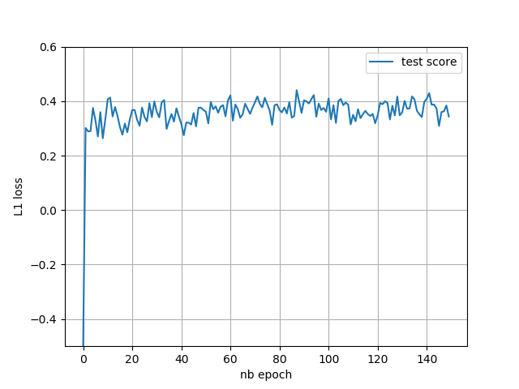

# Prédiction du temps de réponse des véhicules de la Brigade de Sapeurs-Pompiers de Paris

Lien vers la présentation du challenge : [Challenge data](https://challengedata.ens.fr/challenges/21)

## Modèle et paramètres

Le modèle

```
(fc1): Linear(in_features=1964, out_features=64, bias=True)
(dropout 1): Dropout(p=0.2, inplace=False)
(fc2): Linear(in_features=64, out_features=3, bias=True)
```

L'optimisation

```
optimizer = optim.SGD(net.parameters(), lr=0.01, momentum=0.9, weight_decay=10e-4)
scheduler = StepLR(optimizer, step_size=40, gamma=0.1)
criterion = nn.L1Loss()
```

## Résultats

La loss sur le set d'entrainement et sur le set de validation. ($L_1\approx 72\text{ secondes}$)


La coeficient de détermination (R2 score) sur le set de validation ($R^2 \approx 0.38$).


